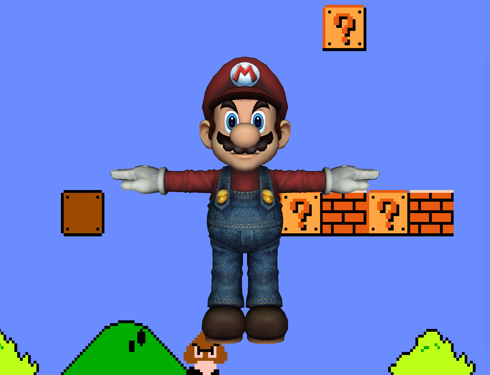
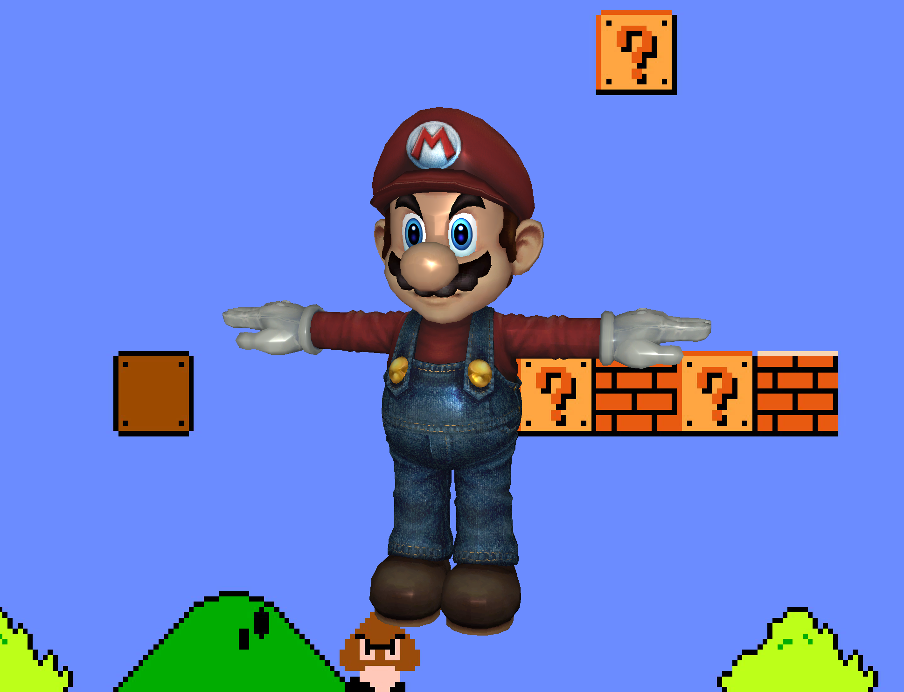
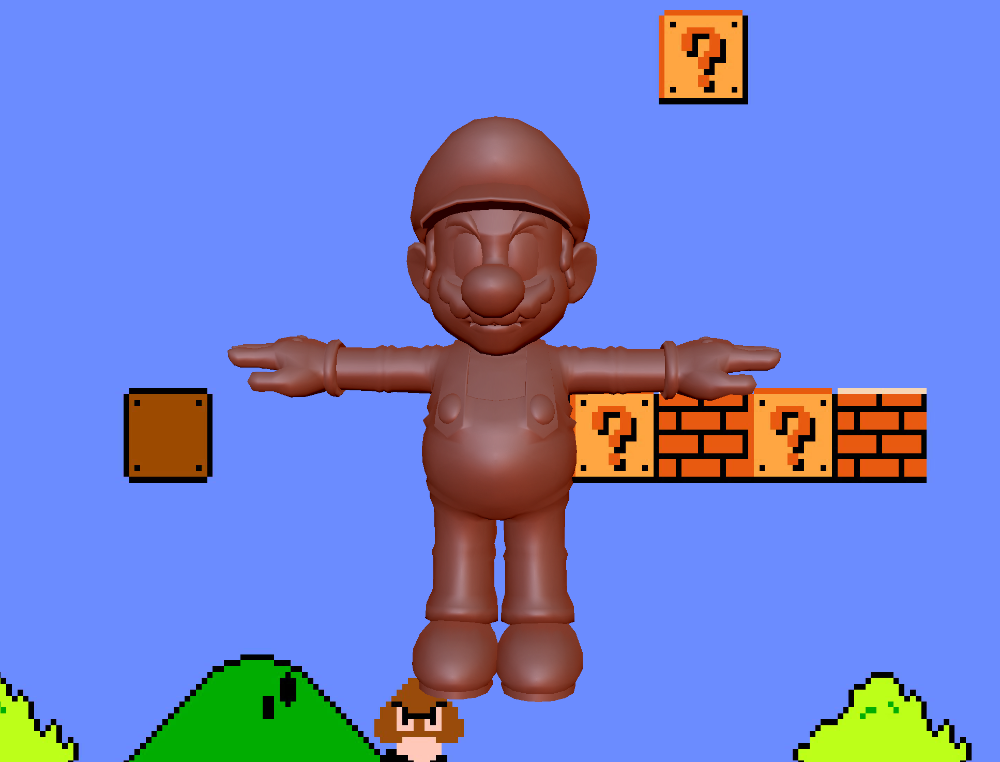
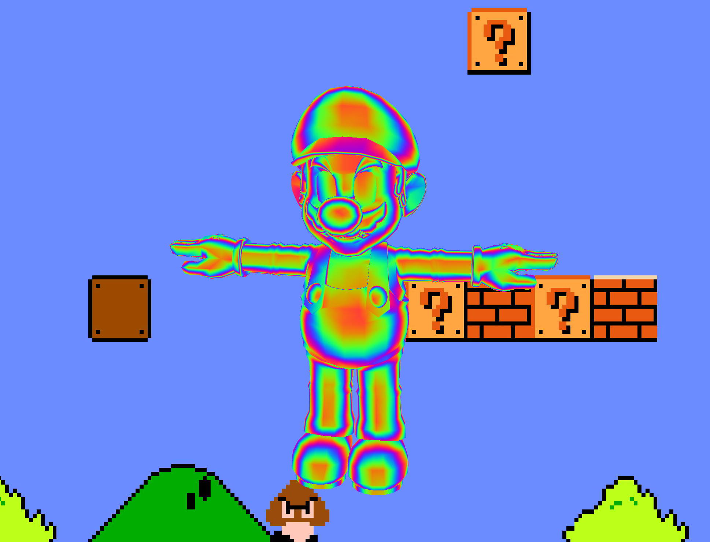
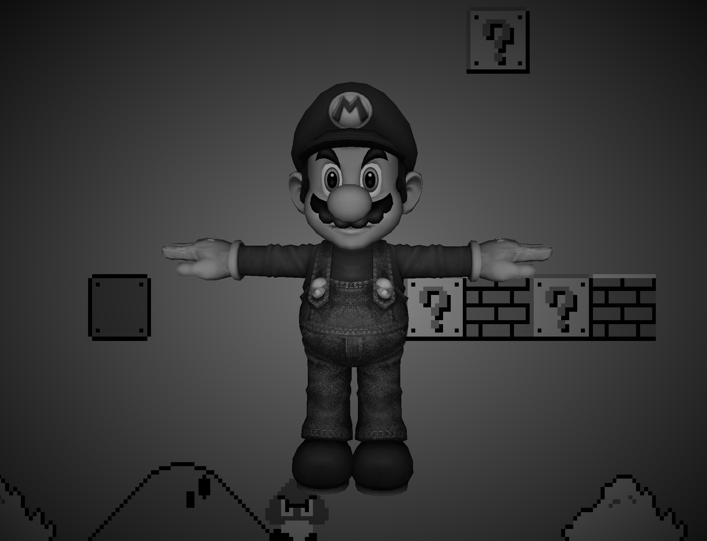
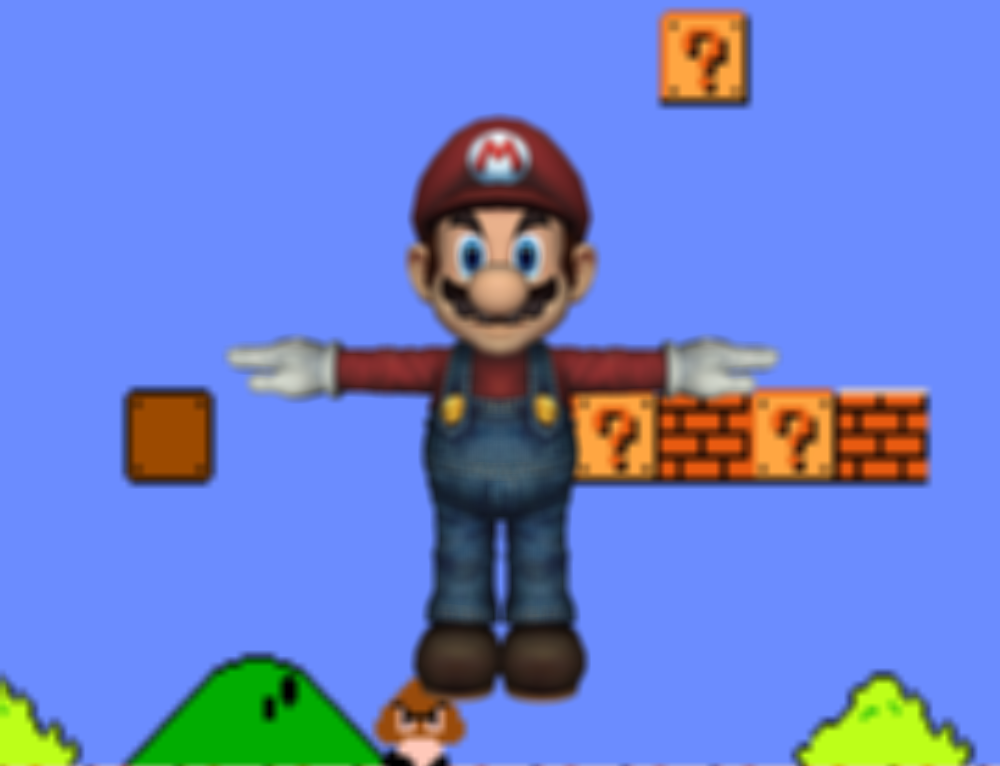
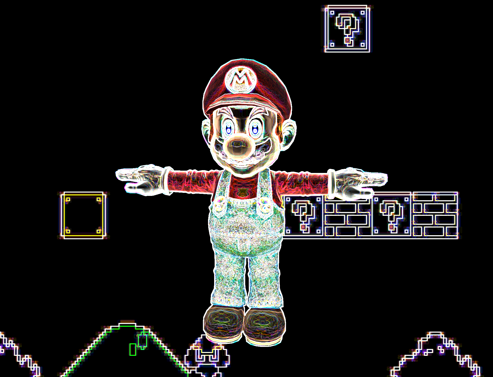
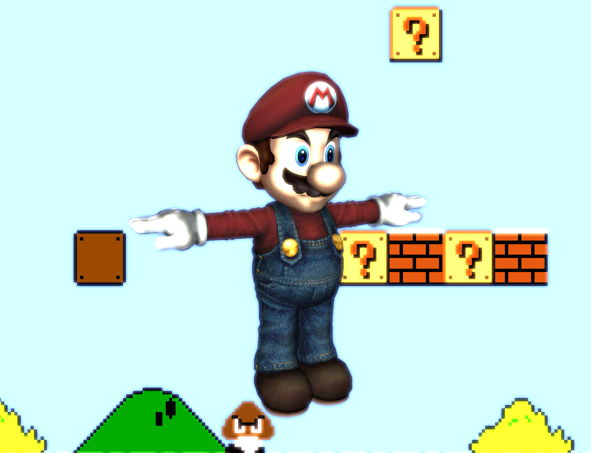
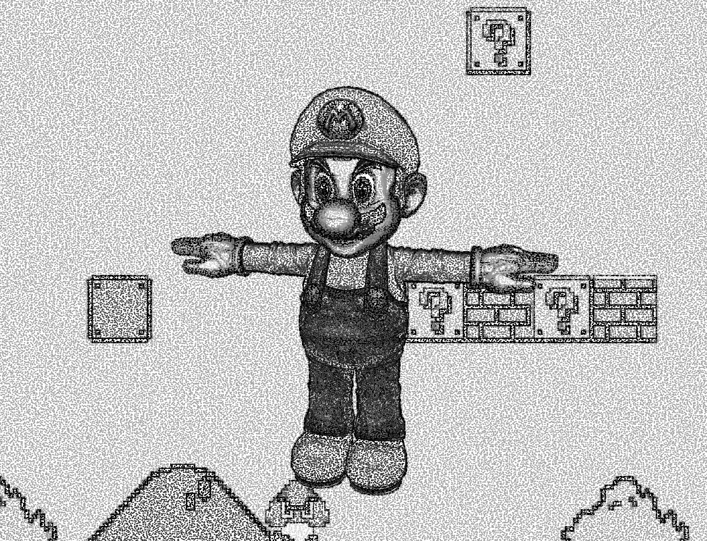

# Shader Fun

### Lambert Shader

### Blinn-Phong Reflection Shader

### Matcap Reflection Shader

### Iridescent Shader

## Post-process effect

### Greyscale and vignette shader

### Gaussian Blur Shader

### Sobel Filter Shader

### Fake Bloom Shader

### Worley Noise

